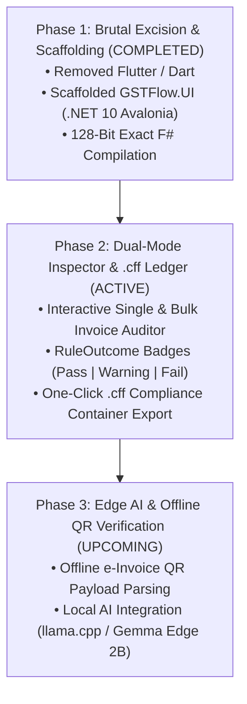

# GSTFlow Pro UI (`GSTFlow.UI`) — Avalonia .NET 10 / F# Engine
**Operation ADIMURAI (அடிமுறை) — 100% Offline, 128-Bit Exact Compliance UI**

---

## Why Avalonia UI Over Flutter?

During **Operation Adimurai**, we surgically excised Flutter (`flutter_app/`) and Dart from our stack. Why?
1. **64-Bit Float Drift Risk:** Dart relies on IEEE 754 64-bit floating-point numbers (`double.parse`), which introduce subtle binary drift (`0.1 + 0.2 != 0.3`). In statutory GST compliance, this is unacceptable.
2. **True 128-Bit Decimal Precision:** By building our UI in **Avalonia UI (.NET 10 / Pure F#)**, our interface directly references `GSTFlow.Rules` and operates on native 128-bit `System.Decimal` numbers—guaranteeing zero rounding errors across Desktop (Windows/Linux/macOS) and Mobile Pro (Android/iOS).

---

## 3-Phase UI Execution Roadmap

### Phase 1: Brutal Excision & Scaffolding (Completed under Operation Adimurai)
- Surgically removed `flutter_app/` and Dart wrappers.
- Created pure F# Avalonia UI project (`GSTFlow.UI.fsproj`) referencing `GSTFlow.Rules` and `GSTFlow.Core`.
- Verified zero build warnings/errors and 100% test pass rates.

### Phase 2: Dual-Mode Inspector & `.cff` Ledger View (Active)
- Desktop GUI & Mobile Pro view displaying line-item precision and Place of Supply cross-border checks.
- One-click export of SHA-256 sealed `.cff` compliance containers.

### Phase 3: Edge AI & Offline QR Scanner Controls (Upcoming)
- Integration of on-device camera e-Invoice QR decoding and local edge AI extraction models (`Gemma E2B` / `llama.cpp`).
